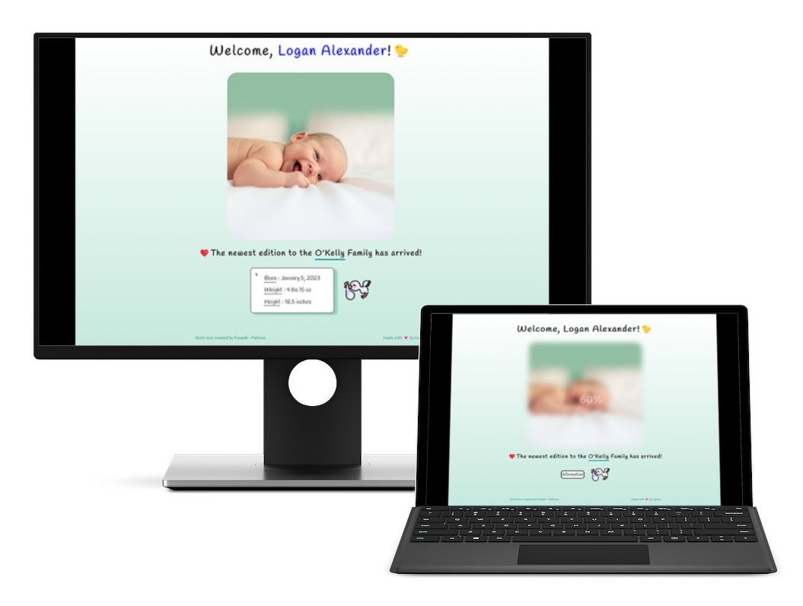

# Blur Effect Image Reveal

This is an application of the [Blurry Loading project in the Udemy course 50 Projects in 50 Days](https://www.udemy.com/course/50-projects-50-days/?src=sac&kw=50+projects+50+days) to a new baby image reveal.

## Project Details

### View My Project:

## Features

- Baby image loads blurry.
- Countdown occurs for image reveal.
- Name changes color on reveal to indicate gender.
- Information button can be clicked to show or hide birth info.

## Technologies Used

- HTML
- CSS
- JavaScript

## Acknowledgements

Project idea: Brad Traversy, Florin Pop [Udemy course 50 Projects in 50 Days](https://www.udemy.com/course/50-projects-50-days/?src=sac&kw=50+projects+50+days)

Original HTML, CSS & Javascript provided by: Brad Traversy, Florin Pop [Udemy course 50 Projects in 50 Days](https://www.udemy.com/course/50-projects-50-days/?src=sac&kw=50+projects+50+days)

Baby Image: [Filip Mroz](https://unsplash.com/@mroz) on [Unsplash](https://unsplash.com/photos/oko_4WnoM98)